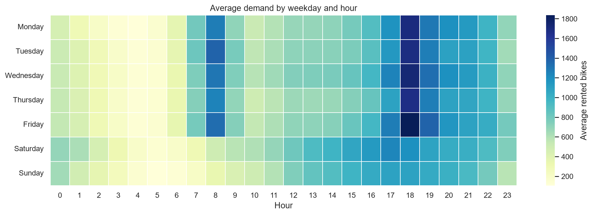
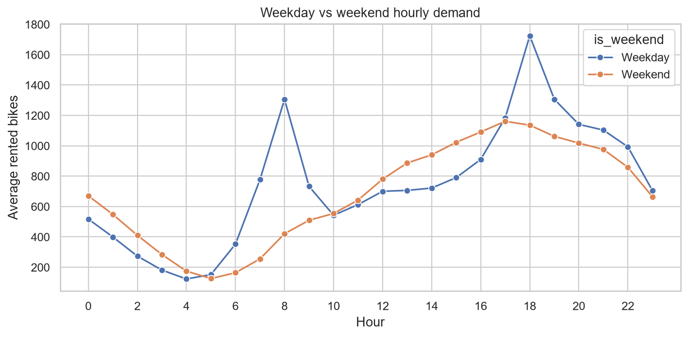

# 서울 공공자전거 수요 패턴 분석

## 문제 정의

시간·요일·계절·강수량에 따라 달라지는 서울 공공자전거 시간당 대여 수요를 분석한다. 목적은 단순한 수요 설명이 아니라, 운영자가 자전거 재배치와 악천후 대응을 판단할 때 사용할 수 있는 근거를 만드는 것이다.

## 분석 질문

1. 대여 수요가 가장 높은 시간대와 요일은 언제인가?
2. 평일 출퇴근 수요와 주말 여가 수요는 시간대별로 어떻게 다른가?
3. 계절과 강수량은 시간당 대여 수요에 어떤 영향을 미치는가?

## 데이터

- 출처: [UCI Machine Learning Repository — Seoul Bike Sharing Demand](https://archive.ics.uci.edu/dataset/560/seoul+bike+sharing+demand)
- 관측 기간: 2017-12-01 ~ 2018-11-30
- 관측 단위: 시간당 집계
- 주요 측정값: 대여 자전거 수, 시간, 계절, 휴일, 기온, 습도, 강수량 등

원본·정제 데이터와 생성 그래프는 Git에 커밋하지 않는다. 아래 명령으로 동일한 결과를 다시 생성할 수 있다.

```powershell
python src/download_data.py
python src/analyze.py
```

## 분석 방법

1. 날짜와 시간 컬럼을 결합하여 관측 시점을 만들고, 월·요일·주말 여부를 파생한다.
2. 운영하지 않은 날(`Functioning Day = No`)은 수요 비교에서 제외한다.
3. 시간대·요일·월·계절·강수량별 평균 대여 수를 비교한다.
4. 그래프와 지표를 바탕으로 운영 제안을 작성한다. 인과관계는 주장하지 않는다.

## 핵심 결과물

`python src/analyze.py` 실행 후 아래 파일이 생성된다.

| 파일 | 질문과의 연결 |
| --- | --- |
| `hourly-demand.png` | 수요가 가장 높은 시간대 |
| `weekday-demand.png` | 요일별 수요 차이 |
| `hour-weekday-heatmap.png` | 시간대 × 요일 수요 집중 구간 |
| `weekday-weekend-pattern.png` | 평일과 주말의 시간대별 패턴 비교 |
| `monthly-demand.png` | 월별 수요 변화 |
| `seasonal-demand.png` | 계절별 수요 차이 |
| `rainfall-demand.png` | 강수 구간별 수요 차이 |
| `results/generated/analysis-report.md` | 발견, 운영 제안, 한계 |

## 결과 미리보기





## 실행 환경

Python 3.11 이상을 권장한다.

```powershell
python -m venv .venv
.\.venv\Scripts\Activate.ps1
pip install -r requirements.txt
python src/download_data.py
python src/analyze.py
```

## 한계

- 데이터는 시간 단위 집계이므로 대여소별 재배치 위치를 직접 결정할 수 없다.
- 한 해의 데이터이므로 해마다 같은 수요 패턴이 재현된다고 단정할 수 없다.
- 날씨와 수요의 관계는 상관관계이며, 다른 계절·휴일 요인이 함께 영향을 줄 수 있다.
