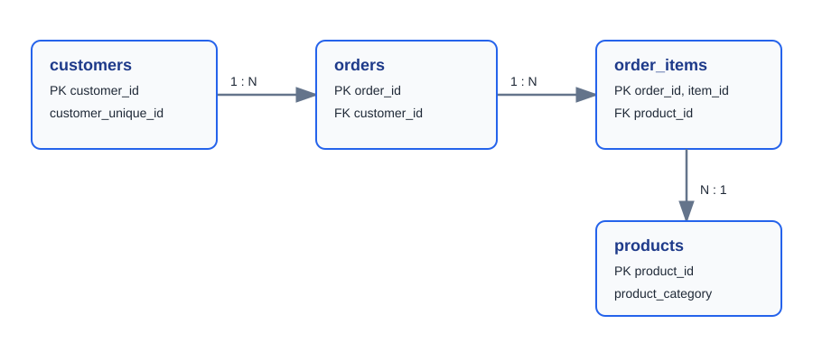

# 이커머스 주문·고객·상품 SQL 분석

## 문제 정의

쇼핑몰 주문 데이터를 MySQL 관계형 모델로 적재한 뒤, 매출·고객·상품 지표를 SQL로 분석한다. Python은 원본 CSV 정제와 SQL 결과 검증에 사용하고, 비즈니스 질문에 대한 답은 SQL로 작성한다.

## 데이터

- 출처: [Brazilian E-Commerce Public Dataset by Olist](https://www.kaggle.com/datasets/olistbr/brazilian-ecommerce)
- 제공 범위: 2016~2018년 브라질 이커머스 주문 데이터
- 사용 원본: customers, orders, order_items, products, product-category translation
- 분석 매출: 배송 완료(delivered) 주문의 price + freight_value

이 데이터는 상품 카테고리와 고객 고유 ID를 제공하므로 고객 재구매·카테고리·객단가 분석에 적합하다. 원본 및 변환 CSV는 Git에 커밋하지 않는다.

## 데이터 모델

~~~mermaid
erDiagram
    CUSTOMERS ||--o{ ORDERS : places
    ORDERS ||--|{ ORDER_ITEMS : contains
    PRODUCTS ||--o{ ORDER_ITEMS : appears_in
    CUSTOMERS {
        varchar customer_id PK
        varchar customer_unique_id
        varchar customer_city
        char customer_state
    }
    PRODUCTS {
        varchar product_id PK
        varchar product_category
    }
    ORDERS {
        varchar order_id PK
        varchar customer_id FK
        varchar order_status
        datetime purchase_at
    }
    ORDER_ITEMS {
        varchar order_id PK,FK
        int order_item_id PK
        varchar product_id FK
        decimal price
        decimal freight_value
    }
~~~

독립 Mermaid 원본은 [docs/erd.mmd](docs/erd.mmd)에 있다. GitHub README에서 바로 렌더링되며, 필요하면 Mermaid Live Editor 등에서 PNG로 내보낼 수 있다.

## 실행 순서

### 1. 원본 다운로드 및 변환

~~~powershell
python src/download_data.py
python src/transform_data.py
~~~

### 2. MySQL 준비

MySQL 8.0 이상에서 스키마를 생성한다.

~~~powershell
mysql -u root -p < sql/schema.sql
~~~

환경 변수로 접속 정보를 설정한다. 비밀번호를 코드나 Git에 기록하지 않는다.

~~~powershell
$env:MYSQL_HOST = "localhost"
$env:MYSQL_PORT = "3306"
$env:MYSQL_DATABASE = "shopping_analytics"
$env:MYSQL_USER = "app_user"
$env:MYSQL_PASSWORD = "local_password"
python src/load_to_mysql.py --reset
~~~

### 3. SQL 실행과 Python 검증

~~~powershell
mysql -u app_user -p shopping_analytics < sql/analysis_queries.sql
python src/verify_monthly_revenue.py
~~~

## 분석 SQL 10개

| 번호 | 질문 | SQL 기능 |
| ---: | --- | --- |
| 01 | 월별 매출은 어떻게 변하는가? | DATE_FORMAT, 집계 |
| 02 | 매출 상위 상품은 무엇인가? | GROUP BY, LIMIT |
| 03 | 누적 구매액 상위 고객은 누구인가? | 조인, 집계 |
| 04 | 재구매 고객 비율은 얼마인가? | CTE, HAVING |
| 05 | 월별 신규·기존 고객 매출은? | Window Function |
| 06 | 주문 이력이 없는 고객은? | LEFT JOIN |
| 07 | 카테고리별 객단가는? | 주문 단위 재집계 |
| 08 | 최근 구매 기준 휴면 고객은? | 기준일 CTE, 날짜 계산 |
| 09 | 월별 상품 매출 순위는? | DENSE_RANK() |
| 10 | 고객별 RFM 기초 지표는? | 다중 CTE |

## 데이터 해석 시 주의점

- 주문 이력이 없는 고객은 원본이 주문 중심으로 수집됐기 때문에 결과가 0명일 수 있다. 쿼리는 CRM/회원 테이블로 확장 가능한 형태로 유지한다.
- customer_id는 주문 시점 고객 레코드이고, 재구매 분석은 customer_unique_id 기준으로 한다.
- 데이터 마지막 구매일을 분석 기준일로 사용하므로 휴면 고객은 데이터셋 내부 상대 기준이다.
- 카테고리 번역이 없는 상품은 unknown으로 보존한다.
