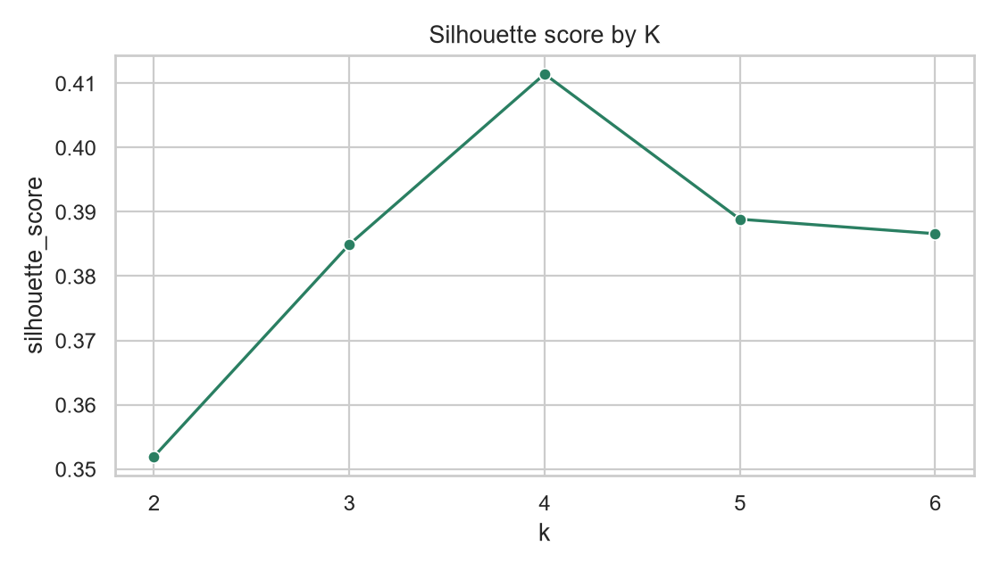
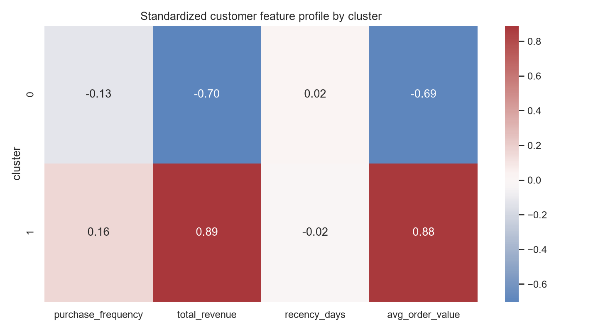

# 이커머스 고객 세분화와 프로모션 전략

## 문제 정의

제한된 마케팅 예산에서 모든 고객에게 같은 혜택을 제공하는 대신, 구매 행동이 유사한 고객군을 식별하고 고객군별 프로모션 전략을 설계한다.

## 데이터와 범위

- 입력 데이터: [03_sql-analysis](../03_sql-analysis/) 프로젝트가 변환한 Olist 이커머스 주문 데이터
- 분석 대상: 배송 완료 주문이 1건 이상인 고객 고유 ID
- 분석 단위: 고객 한 명당 한 행
- 제외 범위: 결제·리뷰·배송 지연은 이번 세분화 특성에 포함하지 않는다.

기존 [Cluster_ShoppingMall.ipynb](../Clustering/Cluster_ShoppingMall.ipynb)는 make_blobs로 생성한 합성 데이터 실습이다. 이 프로젝트는 해당 노트북을 삭제하거나 실제 데이터처럼 표현하지 않고, 실제 거래 데이터를 사용해 별도로 재구성한다.

## 고객 특성

| 특성 | 정의 | 역할 |
| --- | --- | --- |
| purchase_frequency | 배송 완료 주문 수 | 구매 반복성 |
| total_revenue | 상품가와 배송비의 누적 합계 | 고객 가치 |
| recency_days | 데이터 기준일과 마지막 구매일의 차이 | 이탈 위험 신호 |
| avg_order_value | 주문당 평균 매출 | 구매 단가 |
| preferred_category | 매출이 가장 큰 상품 카테고리 | 군집 해석·프로모션 소재 |

카테고리 선호도는 명목형 변수이므로 거리 기반 K-Means의 입력값에는 넣지 않는다. 군집을 만든 뒤 해석에만 사용한다.

## 방법

1. 주문·주문상품·상품·고객 테이블에서 고객 특성을 생성한다.
2. 분포가 긴 매출·주문 수에는 log1p 변환을 적용한다.
3. 모든 수치 특성에 StandardScaler를 적용한다. K-Means는 유클리드 거리 기반이므로 금액과 일수·건수를 그대로 비교하면 큰 단위 변수가 거리를 지배한다.
4. K=2~6에 대해 inertia와 silhouette score를 모두 비교한다.
5. silhouette score가 가장 높은 K를 우선 선택하되, 최소 군집 비율이 5% 미만이면 후보에서 제외한다.
6. random seed 10개와 80% 표본 반복에서 Adjusted Rand Index를 비교해 안정성을 확인한다.

## 실행 순서

먼저 3단계의 변환 데이터를 만들어야 한다.

~~~powershell
Set-Location ..\03_sql-analysis
python src/download_data.py
python src/transform_data.py

Set-Location ..\04_customer-segmentation
pip install -r requirements.txt
python src/build_features.py
python src/segment_customers.py
~~~

## 생성 결과

| 결과물 | 설명 |
| --- | --- |
| customer_features.csv | 고객별 RFM·객단가·선호 카테고리 |
| customer_segments.csv | 군집 번호와 프로필용 특성 |
| elbow-score.png | K별 inertia |
| silhouette-score.png | K별 silhouette score |
| customer-segments-pca.png | PCA 2차원 군집 분포 |
| cluster-profile.png | 군집별 표준화 특성 비교 |
| segmentation-report.md | 선택한 K, 안정성, 전략, 한계 |

## 결과 미리보기

## 실행 결과와 선택 근거

- **분석 고객:** 배송 완료 주문이 있는 고유 고객 93,358명
- **선택 군집 수:** K=2
- **선택 근거:** K=3 이상은 silhouette score가 더 높았지만 최소 군집 비율이 약 2.9%로 나타났다. 최소 5% 기준을 충족하면서 silhouette score가 가장 높은 K=2를 선택했다.
- **안정성:** 80% 표본을 seed 10개로 반복했을 때 평균 ARI는 **0.991**이었다.

즉, K=4를 임의로 택한 것이 아니다. K=3~6은 약 2.9%의 소규모 군집을 만들어 제한된 마케팅 예산으로 독립 캠페인을 설계하기에 실행 가능성이 낮았다. 두 군집은 각각 44% 이상으로 충분한 규모를 가지며, 재현성 검증도 통과했다.

| 군집 | 고객 수 | 비율 | 평균 누적 매출 | 평균 최근성 | 추천 프로모션 |
| ---: | ---: | ---: | ---: | ---: | --- |
| 0 | 52,182명 | 55.9% | 68.94 | 240.7일 | 재활성화 쿠폰과 선호 카테고리 리마인드 |
| 1 | 41,176명 | 44.1% | 287.12 | 232.1일 | VIP·신상품 우선 안내와 혜택 유지 |

군집 1은 군집 0보다 고객당 평균 누적 매출이 약 4.2배 높다. 따라서 동일한 할인 대신 군집 0에는 재방문 유도, 군집 1에는 혜택 유지와 신상품 접근을 우선 적용하는 전략이 적합하다.

## 이탈 예측과 결합하는 방법

세분화는 고객군을 이해하는 **비지도학습**이고, 이탈 예측은 개별 고객의 이탈 확률을 계산하는 **지도학습**이다. 두 결과를 결합하면 동일한 이탈 위험이라도 고객 가치와 행동 특성에 따라 유지 비용을 다르게 배정할 수 있다.

| 고객군 | 이탈 위험 | 권장 전략 |
| --- | --- | --- |
| 고가치·저위험 | 낮음 | VIP 혜택 유지와 신상품 우선 안내 |
| 고가치·고위험 | 높음 | 즉시 유지 캠페인, 개인화 혜택, 상담 우선 배정 |
| 저가치·고위험 | 높음 | 비용 제한형 자동 쿠폰·리마인드 캠페인 |
| 저가치·저위험 | 낮음 | 기본 적립 혜택과 저비용 콘텐츠 안내 |

실제 운영에서는 고객별 이탈 확률을 먼저 계산하고, RFM 군집의 누적 매출·최근성·선호 카테고리를 활용해 캠페인 우선순위와 혜택 유형을 정한다. 군집 번호 자체는 고객 등급이나 인과관계가 아니므로, 캠페인 효과는 별도 A/B 테스트로 검증해야 한다.

## 한계

- 군집은 고객 행동의 유사성이지 인과관계나 고객의 본질적인 등급을 뜻하지 않는다.
- Olist 데이터는 하나의 기간에 국한되어 있으며 미래 행동을 보장하지 않는다.
- 할인 반응·웹 행동 로그·캠페인 전환 데이터가 없어 프로모션 효과를 직접 검증할 수 없다.
- silhouette score가 높더라도 실제 마케팅에서 행동 가능한 군집인지 별도 판단이 필요하다.
