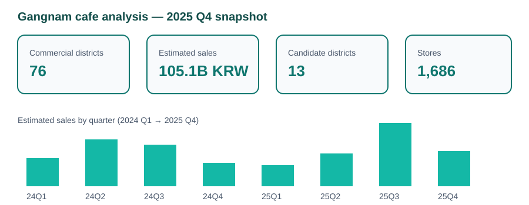
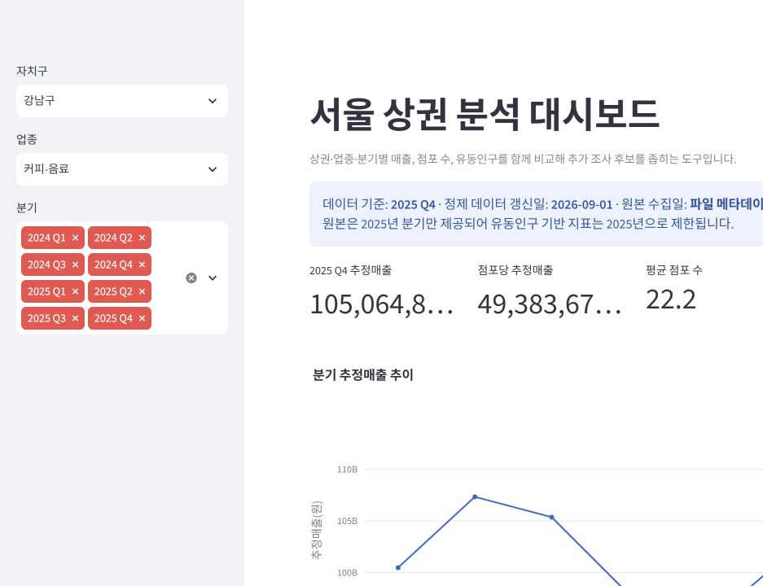
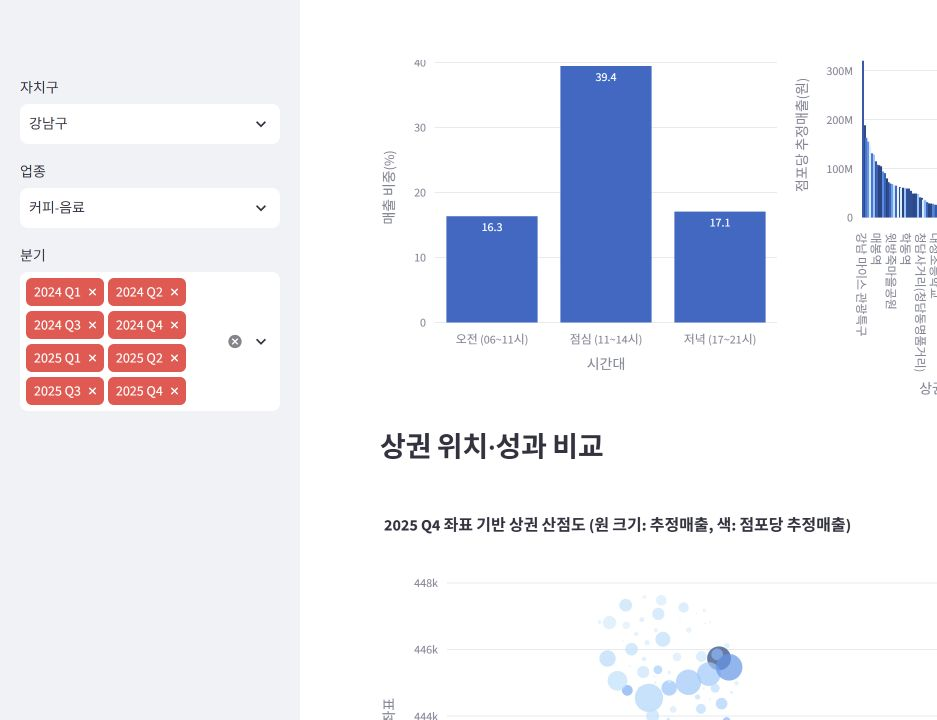

# 강남구 카페업 상권 분석 대시보드

## 문제

예비 자영업자와 상권 분석 담당자가 강남구 카페업의 매출·점포 수·유동인구를 빠르게 비교하고, 매출 증가보다 점포 증가가 빠른 상권을 식별하도록 돕는다.

## 범위와 결합 기준

- 지역: 기본 필터는 강남구, 대시보드에서는 다른 자치구도 비교 가능
- 업종: 기본 필터는 커피·음료, 다른 생활밀접업종도 비교 가능
- 기간: 2024~2025년 분기 자료
- 결합 키: 기준_년분기 + 상권_코드 + 서비스_업종_코드

서울시 상권분석서비스는 분기 단위 데이터다. 월별 추이로 표현하지 않는다. 또한 2024년부터 공간 단위가 표준단위구역으로 변경되었으므로, 이 프로젝트는 2024년 이후 자료만 동일 기준으로 비교한다.

## 데이터

서울 열린데이터광장에서 추정매출-상권, 점포-상권, 길단위인구-상권, 영역-상권 데이터를 내려받는다. 서울 열린데이터광장 API는 개인 인증키가 필요하며, 데이터가 1,000건을 넘으면 페이지 단위로 호출해야 한다. 이 프로젝트는 인증키를 저장하지 않는다. 원본 CSV는 data/raw에 직접 내려받거나 개인 키로 수집한 파일을 둔 뒤 변환한다.

## 실행

~~~powershell
python -m venv .venv
.\.venv\Scripts\Activate.ps1
pip install -r requirements.txt

python src/prepare_dataset.py
streamlit run app.py
~~~

## 지표

| 지표 | 정의 | 주의 |
| --- | --- | --- |
| 분기 추정매출 | 상권·업종 분기 추정 매출 | 실제 개별 점포 매출이 아님 |
| 점포당 추정매출 | 추정매출 / 전체 점포 수 | 점포 수 0은 제외 |
| 점포 수 증감률 | 직전 분기 대비 전체 점포 수 변화율 | 신규·폐업과 구분해 해석 |
| 유동인구 대비 매출 | 추정매출 / 총 유동인구 | 상관관계 지표, 인과 아님 |
| 경쟁도 | 동일 분기·업종에서 점포 수의 백분위 | 높을수록 상대적 경쟁 밀집 |

## 분석 질문

1. 어느 상권의 카페업 매출이 증가하는가?
2. 매출 증가보다 점포 증가가 빠른 상권은 어디인가?
3. 유동인구가 많지만 점포당 추정매출이 낮은 상권은 어디인가?

## 결과 스냅샷

아래는 현재 수집한 자료를 정제해 강남구·커피-음료로 필터링한 결과다. 매출과 점포 수는 2024년 1분기부터 2025년 4분기까지 비교했다.

| 분기 | 추정매출 | 점포 수 | 점포당 추정매출 |
| --- | ---: | ---: | ---: |
| 2024 Q1 | 1,004.6억 원 | 1,717개 | 5,851만 원 |
| 2024 Q2 | 1,073.3억 원 | 1,719개 | 6,243만 원 |
| 2024 Q3 | 1,053.5억 원 | 1,699개 | 6,201만 원 |
| 2024 Q4 | 979.2억 원 | 1,691개 | 5,791만 원 |
| 2025 Q1 | 948.1억 원 | 1,669개 | 5,681만 원 |
| 2025 Q2 | 1,012.6억 원 | 1,661개 | 6,096만 원 |
| 2025 Q3 | 1,133.7억 원 | 1,653개 | 6,858만 원 |
| 2025 Q4 | 1,050.6억 원 | 1,686개 | 6,232만 원 |

### 발견

- 2024년 1분기 대비 2025년 4분기 추정매출은 4.6% 증가했고, 점포 수는 1.8% 감소했다.
- 같은 기간 점포당 추정매출은 6.5% 증가했다. 단순히 점포 수가 많은 상권보다, 상권별 매출 밀도를 함께 확인해야 한다.
- 2025년 3분기에 추정매출과 점포당 추정매출이 모두 가장 높았다. 계절성·휴가 수요·상권별 업종 구성 등 원인을 추가 검증할 필요가 있다.
- 현재 길단위인구 원본은 2025년 분기만 포함한다. 따라서 유동인구 대비 매출과 후보 상권 비교는 2025년 자료에 한정한다.

### 2025년 4분기 상권 단위 비교

강남구 커피·음료 76개 상권을 2025년 4분기 기준으로 비교했다.

| 항목 | 중앙값 | 해석 |
| --- | ---: | --- |
| 상권별 추정매출 | 3.62억 원 | 상권 규모가 달라 총매출만으로 비교하면 왜곡될 수 있음 |
| 상권별 점포 수 | 12개 | 점포 수가 중앙값보다 많으면 경쟁 밀도를 함께 확인 |
| 상권별 유동인구 | 802,922명 | 유동인구 자체는 매출 보장이 아님 |
| 점포당 추정매출 | 2,821만 원 | 상권 간 운영 효율을 비교하는 보조 지표 |
| 경쟁도 백분위 | 67.4 | 같은 업종·분기 내 점포 수의 상대 위치 |

상권별 Pearson 상관계수도 함께 확인했다.

| 비교 지표 | 상관계수 | 해석 |
| --- | ---: | --- |
| 점포 수 ↔ 추정매출 | 0.794 | 점포가 많은 상권일수록 총매출도 큰 경향이 있음 |
| 유동인구 ↔ 추정매출 | 0.665 | 유동인구는 총매출과 관련이 있지만 단독 판단 기준은 아님 |
| 유동인구 ↔ 점포당 추정매출 | 0.070 | 유동인구가 많아도 점포당 매출이 높다고 볼 수 없음 |
| 점포 수 ↔ 점포당 추정매출 | 0.219 | 점포 수만으로 매출 효율을 설명하기 어려움 |

### 후보 상권을 거르는 규칙

2025년 4분기에서 다음 두 조건을 동시에 만족하는 상권을 1차 추가 검토 대상으로 정의했다.

1. 유동인구가 강남구 커피·음료 상권 중앙값 이상
2. 점포당 추정매출이 중앙값 미만

이 조건에 해당하는 상권은 13곳이다. 이는 “창업 추천 목록”이 아니라, 유동인구가 실제 매출로 충분히 전환되지 않는 이유를 확인할 후보군이다. 해당 상권은 임대료, 프랜차이즈 비중, 카페 수, 체류형 시설, 평일·주말 매출 비중을 추가로 검토한다.

### 분석 질문에 대한 현재 답

| 질문 | 현재 데이터로 확인한 답 | 다음 검증 |
| --- | --- | --- |
| 어느 상권의 매출이 증가하는가? | 대시보드에서 상권별 분기 매출 추이를 비교할 수 있으며, 강남구 전체는 2024 Q1 대비 2025 Q4에 증가했다. | 상권별 증감률과 계절성 분리 |
| 매출 증가보다 점포 증가가 빠른 곳은? | 2025 Q3→Q4에 점포 수는 늘고 추정매출은 증가하지 않은 상권이 26곳이었다. | 개업·폐업 점포 수와 임대료 결합 |
| 유동인구는 높지만 효율이 낮은 곳은? | 2025 Q4 기준 13개 후보 상권을 식별했다. | 시간대·요일별 매출과 유동인구 구성 확인 |

### 의사결정 관점의 해석

강남구 카페업 전체 매출이 늘었다는 사실만으로 신규 창업을 추천할 수는 없다. 대시보드에서는 2025년 각 상권을 대상으로 유동인구, 점포당 추정매출, 경쟁도를 함께 비교해 후보지를 좁힌 뒤 임대료·배후 수요·시간대별 매출을 추가 조사하는 순서로 사용한다.

## 결과 미리보기

### 실제 Streamlit 화면

streamlit run app.py로 실행해 강남구·커피-음료·2025 Q4 기본 필터에서 확인한 화면이다.

### 판단을 돕는 인터페이스

- 상권·업종·분기 필터와 KPI 카드로 현재 비교 범위를 명확히 한다.
- 06~11시·11~14시·17~21시의 매출 비중을 비교해 오전·점심·저녁 수요 차이를 확인한다.
- 상권 좌표 산점도는 원 크기를 추정매출, 색을 점포당 추정매출로 표시한다.
- 점포 수 증감과 매출 증감 사분면에서 점포는 늘고 매출이 증가하지 않은 상권을 빠르게 찾는다.
- 유동인구 상위·점포당 추정매출 하위 조건의 후보 상권 표를 제공하며, CSV로 내려받을 수 있다. 기본 필터의 2025 Q4 후보는 13곳이다.
- 화면 상단에 데이터 기준 분기, 정제 데이터 갱신일, 원본 수집일 메타데이터 미제공 사실을 표시한다. 특히 유동인구 기반 지표가 2025년 자료에만 한정됨을 UI에서 명시한다.

## 한계

- 추정매출은 카드 매출 기반의 추정치이며 실제 손익이나 임대료를 포함하지 않는다.
- 유동인구가 상권 매출을 직접 발생시킨다고 결론 내릴 수 없다.
- 2024년 이전 공간 단위와 직접 시계열 비교하지 않는다.
- 원본 CSV에 수집일 메타데이터가 없어, 화면에는 해당 사실을 표시한다. 새 원본을 반영하면 app.py의 DATA_REFRESHED_AT을 정제 실행일로 갱신해야 한다.
