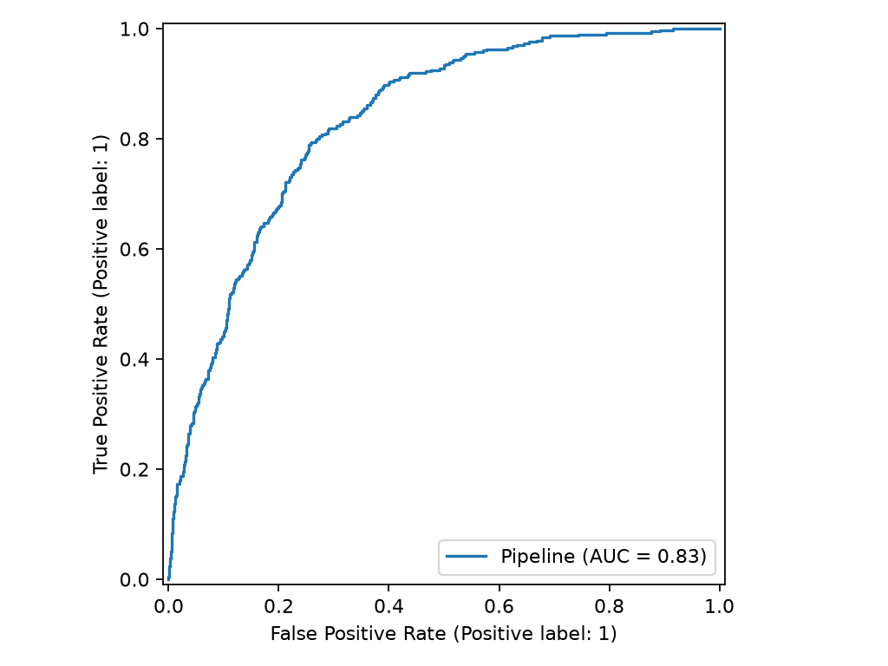
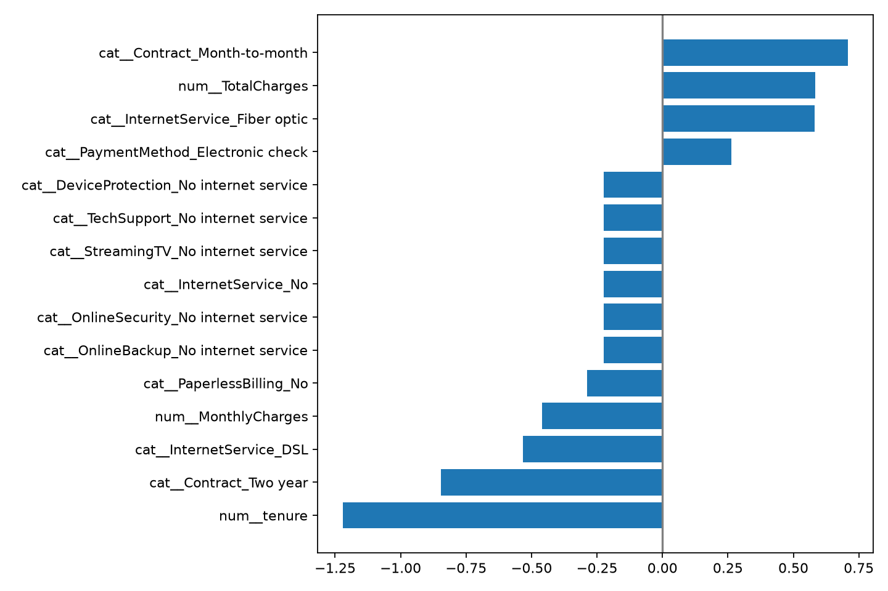

# Telco 고객 이탈 예측

## 문제와 검증

고객의 이탈 확률을 예측해 유지 캠페인 대상을 선별한다. Train 60%, Validation 20%, Test 20%를 stratify로 나누고, 전처리와 스케일링은 Pipeline에서 train 데이터로만 fit했다.

## 실제 결과

최종 Logistic Regression의 Test Recall은 0.807, Precision은 0.508, F1은 0.624, ROC-AUC는 0.832다. 이탈 고객을 놓치는 비용이 더 크다는 가정에서 Recall을 우선했다.

| 이탈 확률 임계값 | 운영 의미 |
| ---: | --- |
| 0.3 | 넓은 유지 캠페인, 비용 증가 |
| 0.5 | 기본 유지 캠페인 |
| 0.7 | 고위험 고객 집중 상담 |

실제 대상 고객 수·Precision·Recall은 results/threshold-policy.csv에 재현된다.

## 해석

장기 계약은 이탈 위험을 낮추는 경향이 있고, 월 요금 부담·전자 수표 결제·지원 서비스 부재는 이탈 위험을 높일 수 있다. 이는 연관성 기반 설명이며, 할인 정책의 효과는 A/B 테스트로 검증해야 한다.

