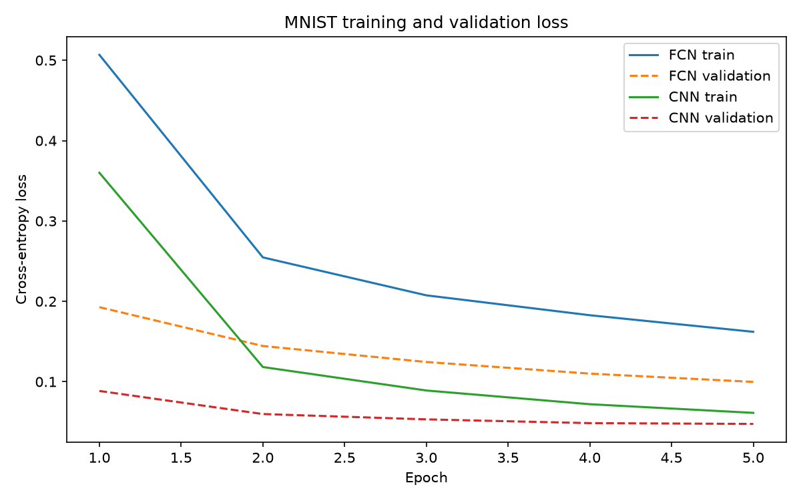
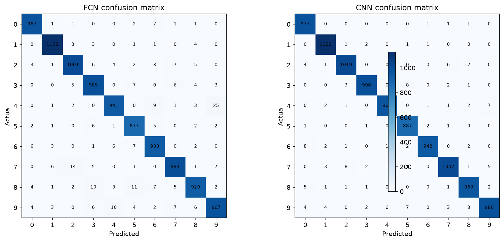
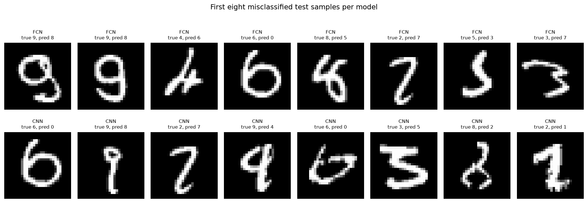

# MNIST FCN vs CNN 벤치마크

MNIST 손글씨 숫자 분류에서 완전연결신경망(FCN)과 합성곱신경망(CNN)을 같은 데이터 분할과 학습 조건에서 비교한다. 기존 [FCN vs CNN 실습 노트북](../CNN/RCN_CNN_Compare.ipynb)의 설명형 코드를 재현 가능한 프로젝트 구조로 확장했다.

## 문제와 검증 원칙

- 원래 학습 데이터 60,000개를 seed `42`의 계층화 분할로 train 48,000개와 validation 12,000개로 나눈다.
- test 10,000개는 체크포인트 선택과 학습에 사용하지 않고, 학습 완료 후 `evaluate.py`에서만 평가한다.
- Python, NumPy, PyTorch 및 CUDA cuDNN의 시드를 고정한다. GPU 연산에는 환경에 따라 미세한 차이가 남을 수 있으므로 결과 실행 환경도 함께 기록한다.
- 최선의 validation accuracy를 낸 모델 하나만 `models/best_fcn.pt` 또는 `models/best_cnn.pt`로 저장한다.

## 실행

프로젝트 디렉터리에서 의존성을 설치한 뒤 실행한다.

```bash
pip install -r requirements.txt
python src/train.py --model both --epochs 5
python src/evaluate.py --model both
python src/benchmark.py --device cpu --batch-sizes 1,128
python -m unittest discover -s tests -v
```

GPU를 명시하려면 `--device cuda`를, CPU 재현 실행에는 `--device cpu`를 사용한다. 실행 중 다운로드되는 MNIST 데이터와 모델 가중치는 Git에 포함하지 않는다.

## 설정과 CI

기본 실험값은 [configs/default.yaml](configs/default.yaml)에 있으며 CLI 인자가 YAML 값보다 우선한다.

```bash
python src/train.py --config configs/default.yaml --epochs 10 --learning-rate 0.0005
```

GitHub Actions는 단위 테스트와 MNIST 다운로드 없이 두 모델이 한 번의 optimizer step을 통과하는 smoke test를 실행한다. 전체 학습·평가는 로컬 또는 GPU 실행 환경에서 명시적으로 수행한다.

## 생성 결과

| 위치 | 내용 |
| --- | --- |
| `models/best_*.pt` | 최고 validation accuracy 체크포인트 |
| `results/validation-model-comparison.csv` | validation 기준 정확도·파라미터 수·학습 시간·파일 크기 |
| `results/model-comparison.csv` | 최종 test accuracy, macro precision/recall/F1, 파라미터 수·파일 크기 |
| `results/metrics.json` | 클래스별 precision, recall, F1을 포함한 상세 평가 지표 |
| `results/inference-benchmark.csv` | CPU/GPU별 batch 1·128 추론 지연 시간과 throughput |
| `results/runtime-info.json` | 실행 device, PyTorch 버전, CUDA 사용 가능 여부, seed, 설정 |
| `assets/loss-curve.png` | train/validation loss 곡선 |
| `assets/confusion-matrix.png` | 모델별 test confusion matrix |
| `assets/misclassified-samples.png` | 모델별 첫 오분류 test 샘플 |

## 실제 실행 결과 — CPU

2026-09-02에 PyTorch `2.13.0+cpu`, seed `42`, 5 epoch, batch size `128`으로 실행했다. CUDA GPU가 없는 환경이므로 아래 수치는 CPU 기준이며 GPU 비교는 CUDA 환경에서 같은 `benchmark.py` 명령으로 추가한다.

| 모델 | Test accuracy | Macro F1 | 파라미터 수 | 학습 시간 | 모델 크기 |
| --- | ---: | ---: | ---: | ---: | ---: |
| FCN | 0.9713 | 0.9711 | 235,146 | 87.91초 | 943,841 B |
| CNN | 0.9869 | 0.9869 | 206,922 | 86.25초 | 831,643 B |

| 모델 | Batch | 평균 지연 시간 | Throughput |
| --- | ---: | ---: | ---: |
| FCN | 1 | 0.241 ms | 4,152 images/s |
| FCN | 128 | 0.835 ms | 153,302 images/s |
| CNN | 1 | 0.524 ms | 1,908 images/s |
| CNN | 128 | 4.353 ms | 29,408 images/s |







## 해석 프레임

CNN의 우수성을 정확도 하나로만 판단하지 않는다. FCN은 28×28 이미지를 784개 숫자로 펼쳐 픽셀의 이웃 관계를 잃는다. 반면 CNN은 작은 필터를 공유해 획·모서리 같은 지역 패턴을 찾고, 그 패턴이 위치를 조금 옮겨도 활용한다.

최종 보고서에서는 다음을 함께 해석한다.

1. **공간 구조 활용:** 혼동행렬과 오분류 샘플에서 CNN이 줄인 오류 유형을 확인한다.
2. **파라미터 효율:** `model-comparison.csv`의 trainable parameter 수와 모델 파일 크기를 비교한다.
3. **학습·추론 비용:** `validation-model-comparison.csv`의 학습 시간을 비교하고, 실제 서비스 요구 지연 시간에서는 별도 배치 추론 측정을 추가한다.
4. **적용 적합성:** 이미지처럼 공간 패턴이 중요한 데이터에는 CNN이 적합하지만, 표 형태 데이터에는 무조건 CNN을 적용하지 않는다.
