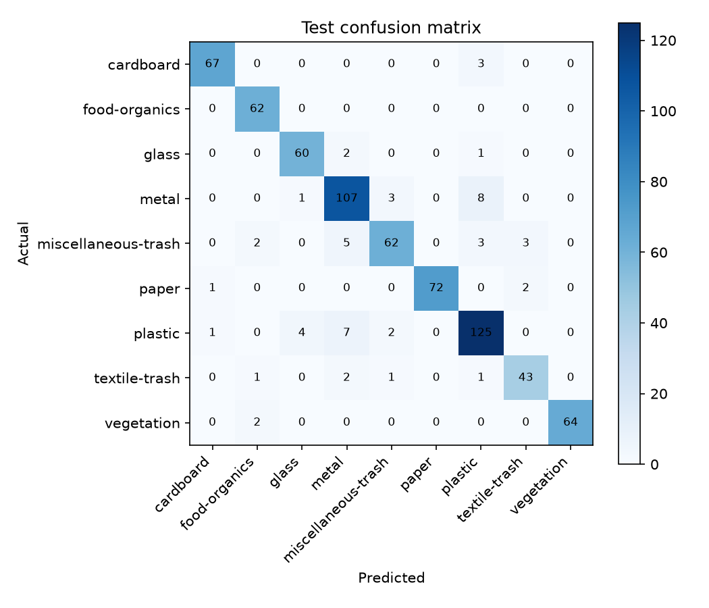
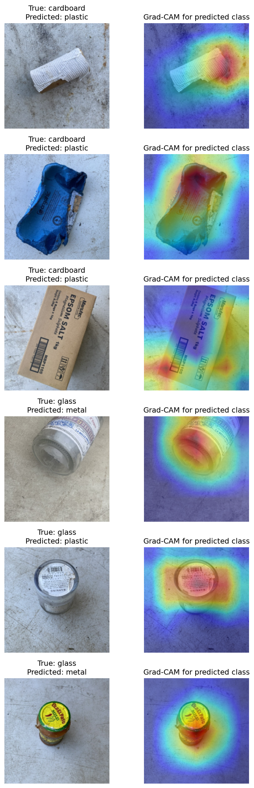
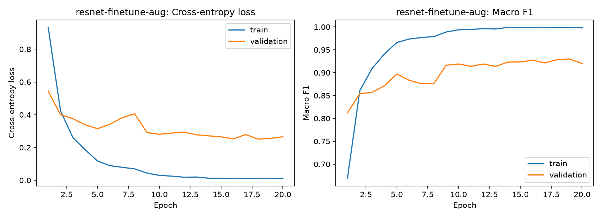
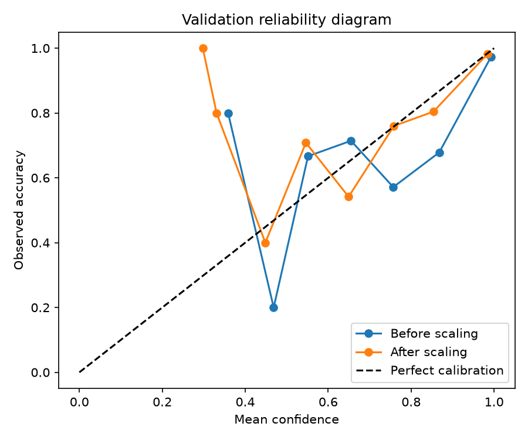

# 폐기물 이미지 분류: Scratch CNN vs ResNet18 전이학습

이미지 한 장을 `paper`, `plastic`, `metal`처럼 사용자가 정의한 폐기물 클래스 중 하나로 분류해, 분리배출 보조 API의 모델 후보를 비교한다. 작은 데이터셋에서 처음부터 CNN을 학습하는 방식과 ImageNet 사전학습 ResNet18을 비교하는 프로젝트다.

## 실행 결과: ResNet18 Fine-tuning + Augmentation

`resnet-finetune-aug`는 ImageNet 사전학습 ResNet18의 전체 계층을 미세조정하고, 데이터 증강과 class weight를 적용한 현재 운영 후보다. RTX 4050 Laptop GPU에서 학습했으며, checkpoint 선택과 확률 보정에는 validation set만 사용했다. test set은 최종 평가 1회에만 사용했다.

| 구분 | 결과 |
| --- | ---: |
| 데이터 | RealWaste 9개 클래스 · train 3,323 / validation 712 / test 717 |
| 최고 validation macro F1 | **0.9299** (epoch 19) |
| test accuracy | **0.9233** |
| test macro precision / recall / F1 | 0.9315 / 0.9289 / **0.9297** |
| 파라미터 수 | 11,181,129 |
| checkpoint 크기 | 44.8 MB |
| 학습 시간 | 1,420.9초 (약 23분 41초) |

### 확률 보정 및 자동 검토 정책

Temperature Scaling은 validation logits로만 적합했다. 보정 뒤 ECE가 낮아졌고, 아래 threshold는 `05_model-serving`의 `needs_review` 정책에 그대로 사용한다.

| 지표 | 보정 전 | 보정 후 |
| --- | ---: | ---: |
| Negative log-likelihood | 0.2542 | **0.2344** |
| Expected calibration error (ECE) | 0.0389 | **0.0188** |

- Temperature: `1.3607`
- 자동 분류 confidence threshold: `0.2977`
- 해당 기준의 validation 자동 처리 비율 / 정밀도: `712 / 712` · `0.9298` (목표 0.90 충족)

### 해석

- 전체 test macro F1은 **0.9297**이지만, `miscellaneous-trash`(F1 0.8671), `metal`(0.8843), `plastic`(0.8929)이 상대적으로 약하다. 다음 데이터 수집·오분류 검토의 우선순위다.
- `food-organics`, `paper`, `vegetation`은 F1 0.96 이상으로 안정적이다. 다만 test 표본 수가 62~75장 수준이므로 외부 환경 이미지로 추가 검증이 필요하다.
- confidence threshold가 낮게 산출된 것은 validation에서 높은 정밀도를 만족하는 예측이 많았다는 뜻이다. 실제 서비스에서는 조명·배경이 다른 외부 검증셋으로 정책을 다시 검증한 뒤 적용한다.

### 시각화

| 혼동행렬 | 오분류 Grad-CAM |
| --- | --- |
|  |  |

| 학습 곡선 | 확률 보정 신뢰도 그래프 |
| --- | --- |
|  |  |

## 검증 원칙

- `data/raw/<class>/`에 넣은 원본 이미지를 클래스별로 seed `42`로 나눈다. 기본 비율은 train 70%, validation 15%, test 15%다.
- validation macro F1로 체크포인트와 Early Stopping을 결정하며, test set은 선택이 끝난 뒤 `evaluate.py`에서 한 번만 사용한다.
- 불균형 클래스에는 train 데이터의 빈도 역수 기반 class weight를 CrossEntropyLoss에 적용한다.
- Python·NumPy·PyTorch·CUDA cuDNN 시드를 고정한다. GPU 환경에 따라 아주 작은 수치 차이는 생길 수 있으므로 실행 환경도 결과에 기록한다.

## 데이터 준비

공개 데이터셋 또는 직접 수집한 이미지를 다음 구조로 배치한다. 클래스 이름은 API 응답에도 그대로 쓰이므로 영문 소문자와 하이픈처럼 안정적인 이름을 권장한다. 데이터 출처·라이선스·제외 기준·한계는 [데이터 카드](docs/data-card.md)에 기록한다.

```text
data/raw/
├── cardboard/
├── glass/
├── metal/
├── paper/
├── plastic/
└── trash/
```

클래스마다 최소 10장 이상이 필요하며, `jpg`, `jpeg`, `png`, `webp` 파일을 지원한다. 원본 데이터와 복사된 분할 데이터는 Git에 포함하지 않는다.

```bash
pip install -r requirements.txt
python src/prepare_data.py
```

`data/processed`가 비어 있지 않으면 기존 분할을 보호하기 위해 중단한다. 새 분할이 필요하면 다른 `--output-dir`를 지정해 생성하고, 검토한 뒤 해당 경로를 학습에 전달한다.

동일 물체의 연속 촬영본이 있으면 [그룹 manifest](data/raw/dataset-manifest.example.csv)를 작성해 `--manifest data/raw/dataset-manifest.csv`로 분할한다. 이 방식은 같은 `group_id`가 train/validation/test에 섞이는 누수를 막는다.

## 핵심 실험

동일한 데이터 분할, seed, epoch 한도에서 아래 YAML 실험 설정을 수행한다. Scratch 모델은 첫 기준선이고, ResNet18의 사전학습 가중치는 첫 실행 시 torchvision이 내려받는다. CLI 인자는 YAML 설정보다 우선한다.

| 실험 | 목적 | 실행 예시 |
| --- | --- | --- |
| `scratch-aug` | 작은 데이터에서 CNN 기준선 확인 | `python src/train.py --config configs/scratch-aug.yaml` |
| `resnet-feature-aug` | 사전학습 특징 추출 효과 확인 | `python src/train.py --config configs/resnet-feature-aug.yaml` |
| `resnet-finetune-aug` | 전체 계층 미세조정 효과 확인 | `python src/train.py --config configs/resnet-finetune-aug.yaml` |
| `resnet-finetune-noaug` | 증강의 일반화 효과 확인 | `python src/train.py --config configs/resnet-finetune-noaug.yaml` |

필요하면 `--class-weighting none`을 별도 실험으로 실행해 불균형 보정의 영향을 비교한다. 작은 데이터에서는 validation macro F1의 평균과 클래스별 F1도 함께 보고, 단일 실행의 미세한 차이만으로 결론 내리지 않는다.

## 최종 평가

validation 결과를 비교해 하나의 운영 후보를 고른 후에만 해당 experiment를 test set으로 평가한다.

```bash
python src/evaluate.py --run-name resnet-finetune-aug
python src/calibration.py --run-name resnet-finetune-aug --model-version resnet18-v1
python -m unittest discover -s tests -v
```

`calibration.py`는 validation logits에 Temperature Scaling을 적용하고, 목표 자동 처리 precision(기본 0.90)을 만족하는 confidence threshold를 결정한다. 결과 [manifest](artifacts/)에는 모델 버전·클래스 순서·전처리·checkpoint SHA-256·보정 온도·검토 threshold가 기록되며 `05_model-serving`에서 그대로 읽는다.

## 결과물과 해석

### 저장 위치와 용도

| 위치 | Git 포함 | 용도 |
| --- | --- | --- |
| `README.md` | 예 | 실험 결론, 핵심 지표, 시각화 |
| `results/` | 예 | CSV·JSON 형식의 재현 가능한 수치 근거 |
| `assets/` | 예 | 혼동행렬, 학습 곡선, Grad-CAM, 신뢰도 그래프 |
| `artifacts/<run-name>/manifest.json` | 예 | 서빙 모델 계약: 클래스 순서·전처리·보정·검토 기준·checkpoint 해시 |
| `models/` | 아니오 | 대용량 가중치 파일 (`.pt`) |
| `data/raw/`, `data/processed/` | 아니오 | 원본 이미지와 분할 데이터 |

현재 실행의 원본 근거는 다음 파일에 고정했다.

- [test 지표 JSON](results/resnet-finetune-aug-test-metrics.json)
- [test 비교 CSV](results/model-comparison.csv)
- [validation 비교 CSV](results/validation-model-comparison.csv)
- [서빙 manifest](artifacts/resnet-finetune-aug/manifest.json)

| 결과물 | 의미 |
| --- | --- |
| `results/validation-model-comparison.csv` | 실험별 validation macro F1, 파라미터 수, 학습 시간, 체크포인트 크기 |
| `results/model-comparison.csv` | 선택된 실험의 최종 test accuracy 및 macro precision/recall/F1 |
| `results/*-test-metrics.json` | 클래스별 precision, recall, F1 및 support |
| `assets/*-learning-curve.png` | 증강과 정규화가 과적합에 미친 영향 확인 |
| `assets/*-confusion-matrix.png` | 서로 자주 혼동하는 재질 확인 |
| `assets/*-gradcam-errors.png` | 오분류에서 모델이 주목한 이미지 영역 확인 |
| `assets/*-reliability.png` | Temperature Scaling 전후 validation reliability diagram |
| `artifacts/<run-name>/manifest.json` | 서빙용 모델 버전·전처리·클래스·보정·검토 정책 계약 |

운영 후보는 정확도만으로 고르지 않는다. 소수 클래스를 놓치지 않는 macro F1, 필요한 메모리·학습 시간·추론 지연 시간, 그리고 Grad-CAM이 배경이나 워터마크가 아닌 재질 특성에 주목하는지를 함께 판단한다. Grad-CAM은 설명 보조 수단이며 인과적 근거는 아니다.
